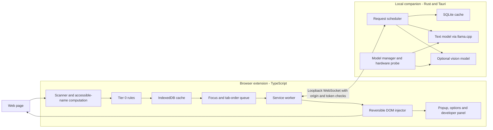

# Handrail Design Document

**Meaningful names for unlabeled web controls, generated on your own machine.**

Handrail is a planned, local-first browser extension that fills in missing accessible names so screen readers can announce useful labels instead of just “button,” “link,” or “image.” It combines deterministic rules, a local cache, and optional small language and vision models running through a companion desktop app.

> **Status: design stage (Draft v0.2).** This repository contains project documentation, a license, and an experimental quality-pilot harness. The extension, daemon, model integrations, and benchmarks described below are planned, not released or validated.

## Why Handrail?

Unlabeled controls make everyday browsing harder for screen reader users. Handrail aims to provide a user-controlled assistive layer on sites where missing names have not been fixed by their authors.

The design prioritizes screen reader users, with support for keyboard-only and low-vision users and a developer mode for inspecting accessibility findings.

- **Local inference:** page context stays on the user's machine.
- **Useful without models:** rules-only mode is the default and works without the companion daemon.
- **Respect existing names:** only elements with an empty computed accessible name enter the labeling pipeline.
- **Stay ahead of focus:** prioritize the focused control and the next controls in tab order.
- **Transparent and reversible:** mark generated labels, support overrides, and restore changes when disabled.
- **Free to use:** no account, subscription, hosted inference service, or telemetry is planned.

Handrail does not certify WCAG compliance or replace accessible site development. Fixing contrast, keyboard traps, and focus order, matching human alt-text quality, and supporting mobile browsers are outside v1 scope.

## How it works

1. **Scan:** inspect the page on load and after debounced DOM mutations, using `dom-accessibility-api` to compute accessible names.
2. **Filter:** retain unnamed controls and relevant images; skip hidden, inert, and otherwise excluded elements. Each permitted frame runs its own scanner.
3. **Resolve:** try deterministic rules and cached labels before requesting local model inference.
4. **Prioritize:** process focused and upcoming controls before off-screen elements and non-focusable images.
5. **Apply:** inject appropriate `aria-label` or `alt` attributes in batches, track changes, and announce a late label through a polite live region when needed.

### Labeling tiers

| Tier | Location | Planned approach |
| --- | --- | --- |
| 0 - Rules | Extension | Icon-library mappings, data attributes, tokenized identifiers, nearby text, and other deterministic hints |
| 1 - Cache | Extension + daemon | IndexedDB mirror and shared SQLite cache keyed by domain and structural fingerprint |
| 2 - Text | Local daemon | Small instruction model generates a short label from sanitized markup and surrounding context |
| 3 - Vision | Local daemon, opt-in | Small vision-language model describes images or identifies icon actions |

Rules use fixed confidence scores. The draft proposes immediate application at confidence >=0.8, with lower-confidence suggestions sent for model confirmation. The final handling of uncertain labels remains subject to the quality pilot and user research.

## Architecture

The extension owns scanning, rules, prioritization, DOM updates, and user controls. The daemon keeps models warm and shares inference and cached labels across browsers.

The v1 transport is JSON over a persistent localhost WebSocket connection per browser profile. Results stream per item rather than waiting for an entire batch. Native Messaging through a thin local shim is a later hardening option.

### Planned stack

| Component | Technology |
| --- | --- |
| Browser extension | TypeScript, Manifest V3 architecture |
| Accessible-name computation | `dom-accessibility-api` |
| Desktop companion | Rust + Tauri tray app |
| Text inference | `llama.cpp` through `llama-cpp-2` |
| Storage | IndexedDB + SQLite |
| Default text model | Qwen2.5-1.5B-Instruct, Q4_K_M |
| Alternative text models | Qwen2.5-3B, Qwen2.5-0.5B, SmolLM2-360M |
| Vision candidates | Moondream2, SmolVLM-256M/500M, Florence-2-base |
| Compute backends | Metal, CUDA/Vulkan, CPU fallback |

Model choices and browser-specific packaging must be validated during implementation. Model versions and checksums will be pinned; each model remains subject to its own license.

## Accessibility safeguards

A wrong label can be worse than a missing one. The design therefore calls for:

- Full accessible-name computation before selecting candidates, preserving existing non-empty names.
- Conservative role inference, with ambiguous controls routed to report-only mode.
- A stricter confidence threshold of 0.9 for destructive-looking controls.
- Short, constrained model output with validation of generic, duplicate, or overly long labels.
- Batched DOM writes to limit screen reader virtual-buffer churn.
- Generated-label markers (`data-handrail`) and reversible change tracking.
- Per-site controls, user edits, and cache clearing.
- Evaluation with screen reader users before broad release.

Low-confidence behavior, decorative-image detection, and safe role/keyboard augmentation still need testing. The draft contains alternative fallback policies; the quality pilot will determine which are appropriate for automatic application.

## Privacy and security

The intended inference path does not send page content to a remote service. Model downloads and explicitly enabled update checks require network access; subsequent inference runs locally.

The companion service is designed to:

- Bind only to the loopback interface.
- Validate extension origins and require a random 32-byte pairing token.
- Reject unauthorized requests, rate-limit failures, and support token rotation.
- Store registrable domains, fingerprints, labels, and cache metadata rather than full URLs or raw page content.
- Restrict SQLite file access to the current OS user.
- Verify model downloads against release-pinned SHA-256 hashes.
- Collect no telemetry.

The threat model covers malicious pages, local processes, and compromised model files. A compromised OS user account is outside its scope. These are implementation requirements, not completed security guarantees.

## Hardware profiles

An install-time hardware probe and generation benchmark will recommend a profile. Downloads remain opt-in.

| Profile | Intended hardware | Proposed models | Estimated model disk use |
| --- | --- | --- | --- |
| Full | >=16 GB RAM or suitable discrete GPU | Qwen2.5-3B + Moondream2 | ~4 GB |
| Standard | 8-16 GB RAM, integrated graphics | Qwen2.5-1.5B + SmolVLM-500M | ~1.6 GB |
| Lite | <8 GB RAM or slow inference | Qwen2.5-0.5B, no vision | ~400 MB |
| Rules-only | Any supported machine | Rules + cache; optional community label pack | No model download |

These are planning estimates from the design document, not measured requirements. Vision is opt-in. Battery-aware pausing and idle model unloading are planned.

## Developer mode

The planned developer panel will list missing names and generated suggestions with their source, tier, and confidence. Developers will be able to accept, edit, or reject labels, preview badges, and export JSON, CSV, or Markdown reports. Edited labels will become local cache entries.

## Evaluation and release criteria

No benchmark results are available yet. The evaluation plan includes:

| Area | Planned validation |
| --- | --- |
| Correctness | Accessible-name tests and 200 HTML fixtures covering named, hidden, decorative, dynamic, and frame-contained elements |
| Label quality | 1,000-element benchmark across 100 pages, including a 200-element human review |
| Quality gate | At least 75% of labels rated >=4/5 and fewer than 5% rated misleading |
| Latency | Publish p50/p95 focus-to-label and page-load-to-first-five-label timings across three hardware profiles |
| Screen reader experience | NVDA and VoiceOver walkthroughs on 10 sites, plus a five-user pilot |
| Non-regression | Compare axe-core findings before and after injection; violation count must not increase |
| Language coverage | Evaluate across five languages |

The draft estimates roughly 150-250 ms per text label on Apple Silicon with a 1.5B model. This is an unverified planning estimate, not a performance claim. The primary target is having labels ready before focus reaches their controls.

## Roadmap

All phases are pending. Durations are estimates from the design draft, totaling approximately 12 weeks.

- [ ] **Phase 0 - Quality pilot (1 week):** run the label-quality experiment and make a go/no-go decision.
- [ ] **Phase 1 - Rules-only extension (2 weeks):** scanner, accessible-name checks, deterministic rules, badges, and report export.
- [ ] **Phase 2 - Local text inference (2 weeks):** Rust daemon, authenticated WebSocket transport, SQLite cache, and constrained text generation.
- [ ] **Phase 3 - Responsive scheduling (1 week):** prioritization, batching, streaming, cancellation, and live-region announcements.
- [ ] **Phase 4 - Desktop experience (2 weeks):** Tauri tray app, hardware profiles, model downloads, and per-site settings.
- [ ] **Phase 5 - Vision and developer tools (2 weeks):** vision inference, DevTools panel, and community cache packs.
- [ ] **Phase 6 - Evaluation and distribution (2 weeks):** user pilot, compatibility testing, documentation, store submissions, and desktop packaging.

Later candidates include a Native Messaging shim, optional browser-native inference, WebGPU fallback, a specialized small labeler, and additional Orca/Linux testing.

## Getting started

There is no installable extension build yet. The experimental quality-pilot harness is runnable locally. This repository establishes the design and implementation roadmap; installation and development commands will be added alongside working code.

The [quality pilot](pilot/README.md) is in progress; a standalone rules-only extension follows the evaluation decision.

## Open questions

- Should uncertain labels be withheld or announced with a “suggested” prefix?
- How stable are structural fingerprints across dynamic content and A/B tests?
- Can a specialized 0.5B model outperform a general 1.5B model on UI labeling?
- How should signed community label packs establish trust and resist poisoned entries?

## Contributing

Early contributions can focus on accessibility fixtures, evaluation methodology, screen reader feedback, and testing the assumptions in this design. Please identify the relevant roadmap phase and distinguish observed results from proposed behavior.

## License

This project is licensed under the [MIT License](LICENSE). Model weights are governed by their individual licenses and are not covered by the project's code license.

---

Based on *Handrail Design Document*, Draft v0.2. This document summarizes the proposed architecture and roadmap; it does not imply that the described capabilities have been implemented.
